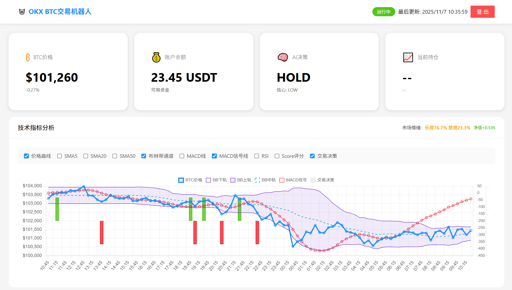
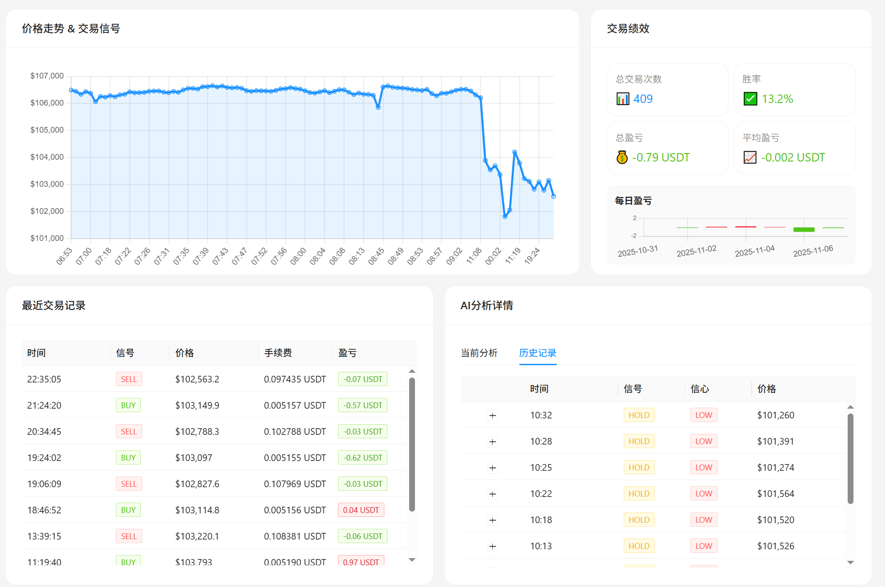

# OKX BTC交易机器人 - 智能交易系统

## 项目概述
这是一个基于DeepSeek AI的OKX BTC/USDT自动交易系统，集成了实时数据分析、AI决策和Web可视化界面。支持Docker容器化部署，确保系统稳定运行。

### 🤖 交易机器人
- **智能AI决策**: 使用DeepSeek AI分析市场趋势
- **技术指标分析**: RSI、MACD、布林带等完整技术指标
- **智能仓位管理**: 动态调整仓位大小
- **风险管理**: 自动止损止盈设置
- **实时监控**: 每3分钟自动执行分析

### 🌐 Web展示界面
- **实时数据监控**: BTC价格、账户余额、持仓情况
- **AI决策展示**: 交易信号、信心程度、分析理由
- **图表可视化**: 价格走势图、绩效统计图表
- **交易记录**: 完整的交易历史记录
- **绩效分析**: 胜率、总盈亏、平均盈亏统计


## 📁 系统架构

### 📊 系统界面展示
网络地址:http://192.3.236.27:8003/
登录/密码: quant/quant@2025

#### 主要功能界面


#### 详细数据分析界面  


### 🏗️ 文件结构
```
├── deepseekok3.py          # 主交易机器人
├── web_app2.py              # Web服务器
├── data_manager.py         # 数据管理模块
├── DOCKER_DEPLOYMENT.md    # Docker部署指南
├── templates/              # Web模板
│   └── antd-index.html          # 主界面
|   ├── login.html               # 登录页面
└── data/                   # 数据存储目录
    ├── system_status.json
    ├── trades.json
    └── performance.json
```

## 🏃‍♂️ 快速开始

### 服务器部署，推荐美国vps服务器部署，价格便宜，无需翻墙，自动运行，访问okx交易所速度快。
推荐美国老牌服务器厂商RackNerd稳定服务器**支持支付宝付款**

### 前期准备

#### 获取API密钥

**AI模型（二选一）：**

1. **DeepSeek API** (默认): https://platform.deepseek.com/
   - 注册账号
   - 创建API Key
   - 模型：deepseek-reasoner

2. **OKX API**: https://www.okx.com/zh-hans
   - API管理 → 创建API，保留KEY,SECRET,PASS
   - 权限：需要"交易"权限，永续合约
   - **重要**：妥善保管密钥，不要泄露

###  传统部署

#### 创建环境​​linux
```bash
git clone https://github.com/huangwm999/AlphaQuant.git
cd AlphaQuant/

sudo apt update && sudo apt install python3-venv -y
python3 -m venv myenv
source myenv/bin/activate  # Linux/Mac
pip install -r AlphaArena/requirements.txt
```

#### 3. 启动服务
# 修改 env_trading.sh.template为 env_trading.sh 填入你的API密钥等环境变量
```bash
source env_trading.sh   # 加载API密钥等环境变量
screen_start.sh
```


#### 4. 访问Web界面
http://localhost:8003

## 🖥️ Web界面功能

### 📊 实时监控面板
- **BTC价格**: 实时价格和涨跌幅
- **账户余额**: 可用资金和总资产
- **AI决策信号**: 当前交易信号和信心程度
- **持仓情况**: 当前持仓方向和盈亏

### 📈 图表分析
- **价格走势图**: BTC价格变化趋势
- **绩效统计**: 每日盈亏柱状图
- **交易信号标记**: 在价格图上标记交易买卖决策线

### 📋 数据展示
- **交易记录**: 最近交易的时间、信号、价格、盈亏
- **AI分析详情**: 决策理由、止损止盈价格
- **技术指标**: RSI、MACD等指标状态

## ⚙️ 交易配置

在 `deepseekok2.py` 中可以调整交易参数：

*** 投入保证金计算公式=下单基数*信心系数*仓位比例%*趋势系数 ***
例：基数100usdt，高信心，仓位0.5，趋势，保证金=100*1.5*1.2=180，所投入保证金为180/10=18usdt

```python
TRADE_CONFIG = {
    'symbol': 'BTC/USDT:USDT',  # OKX的合约符号格式
    'leverage': 10,  # 杠杆倍数,只影响保证金不影响下单价值
    'timeframe': '15m',  # 使用15分钟K线
    'test_mode': False,  # 测试模式开关
    'data_points': 96,  # 24小时数据（96根15分钟K线）
    'analysis_periods': {
        'short_term': 20,  # 短期均线
        'medium_term': 50,  # 中期均线
        'long_term': 96  # 长期趋势
    },
    # 智能仓位参数
    'position_management': {
        'enable_intelligent_position': True,  # 🆕 新增：是否启用智能仓位管理
        'base_usdt_amount': 100,  # USDT投入下单基数
        'high_confidence_multiplier': 1.5,  # 高信心系数
        'medium_confidence_multiplier': 1.0,  # 中信心系数
        'low_confidence_multiplier': 0.5,  # 低信心系数
        'max_position_ratio': 50,  # 单次最大仓位比例默认50%
        'trend_strength_multiplier': 1.2  # 趋势系数
}
```

## 🛠️ 极致简化技术栈
- **后端**: Python + Flask
- **前端**: Antd
- **交易**: CCXT + OKX API
- **AI**: DeepSeek API
- **数据**: JSON文件存储

## 📄 许可证
本项目仅供大数据学习和研究使用，请遵守相关法律法规。
感谢 https://github.com/oficcejo/alpha-arena-okx 提供的指标分析示例。
---

**提示**: 交易有风险，投资需谨慎！

## 📚 相关历史文档

- Document/alphaarena_trading_bot.md - 交易机器人详细说明
- Document/alphaarena_trading_strategy.md - 交易策略详解

## 联系方式
QQ: 425631585